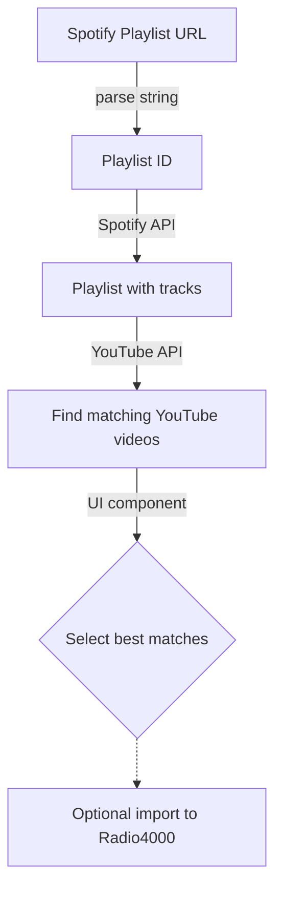

# Convert Spotify playlist → YouTube videos → Radio4000 tracks

A set of JavaScript functions and a web component to help convert the tracks in a Spotify playlist to YouTube videos, and optionally move them to Radio4000 as well.

1. Input a Spotify playlist URL (limit 500 tracks)
2. Allow the tool to search for possible matching YouTube videos
3. Select the matches you want
4. Export to text or json
5. Optionally sign in and import tracks to Radio4000

Try it out on https://spotify-youtube.0sk.ar/ 

Questions? Come chat https://matrix.to/#/#radio4000:matrix.org

## Development

- The tool is made with web components and uses vite as build system.  
- The `main` branch auto-deploys via GitHub pages.
- It reads data from Spotify and YouTube via https://github.com/radio4000/media-now-deno
- It inserts data into Radio4000 using https://github.com/radio4000/sdk

